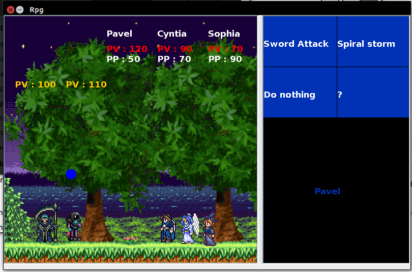

# rpg2
Simulation d'un mode combat type RPG 

La source se lance via le .jar dans le dossier src/

simulation : vous avez une equipe de 3 personnage (Pavel ,Cynthia et Sophia) et pour le moment 

L'ecran de droite permet la selection des commandes via les fleches du clavier.
capture :  

